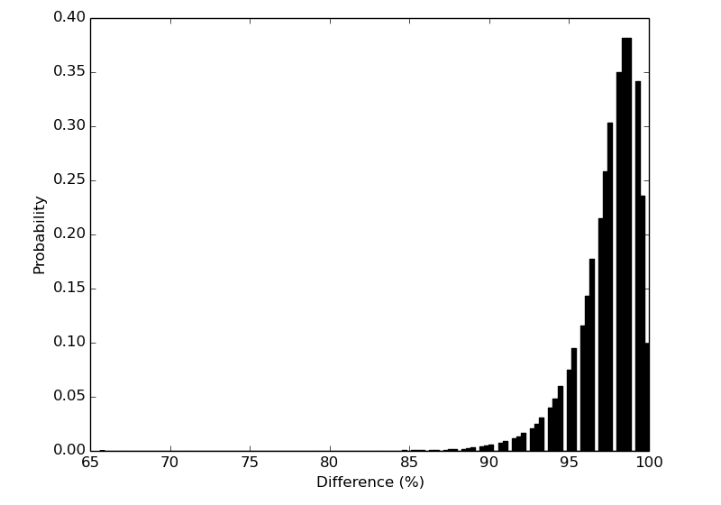

d-AES
=====

**Note:** This is not mean't to be fast. As I work I'll try to optimize to the best of my ability but this is above all a **POC** implementation of dynamic S-Boxes! (It does **MUCH** under PyPy!)

A pure python3(/2.7) implementation of the Rijndael cipher (AES) based on Brandon Sterne's python2.5 [implementation](http://brandon.sternefamily.net/2007/06/aes-tutorial-python-implementation/) that additionally implements modifications to the AES Cipher suggested in various academic papers to dynamically generate S-Boxes from the cipher key instead of using the fixed Rijndael S-Box.

I am using the Hosseinkhani-Javadi method to generate the S-Box, although using all 256 bits of the key instead of just the first 128 to perform two rounds in a similar fashion to a block cipher.

One possible attack method would be to generate all possible S-Boxes from all possible 256 bit AES keys and apply them during the subBytes step as suggested by Hosseikhani and Javadi, but the number of possible S-Boxes is somewhere around 10 to the power of 38, factorial ((10^38)!) choices for 128-bits of key. By mixing a full 256 bit key with itself and using each 128 bit half of the key for two rounds of the sboxRound function we increase the number of possible S-Boxes to 2^256. 

Visulization
------------
Over ~650,000 iterations

Academic Papers
---------------

* [Using Cipher Key to Generate Dynamic S-Box in AES Cipher System](http://cscjournals.org/csc/manuscript/Journals/IJCSS/volume6/Issue1/IJCSS-630.pdf) by R. Hosseinkhani and H. Haj Seyyed Javadi
* [IMPLEMENTATION OF STRONGER AES BY USING DYNAMIC S-BOX DEPENDENT OF MASTER KEY](http://www.jatit.org/volumes/Vol53No2/6Vol53No2.pdf) by S. Arrag, A. Hamdoun, A, Tragha, and S. Eddine Khamlich
* [Generation of AES Key Dependent S-Boxes using RC4 Algorithm](http://www.mtc.edu.eg/asat13/pdf/ce24.pdf) by Abd-ElGhafar, A. Rohiem, A. Diaa, and F. Mohammed
* [Dynamic Substitution Box](http://shodhganga.inflibnet.ac.in/bitstream/10603/5051/12/12_chapter%203.pdf)
